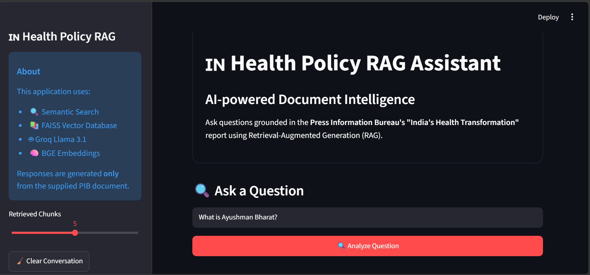
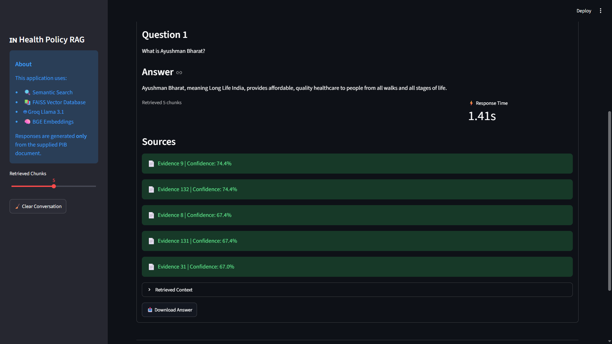

# 🇮🇳 India Health Policy RAG Assistant

An AI-powered Retrieval-Augmented Generation (RAG) application that answers questions from the Press Information Bureau's **"India's Health Transformation"** report using semantic search and Large Language Models.

---

## 📌 Overview

This project demonstrates a complete Retrieval-Augmented Generation (RAG) pipeline for document-based question answering.

Instead of relying solely on a Large Language Model, the application first retrieves the most relevant information from the provided PIB health policy document using vector similarity search. The retrieved context is then supplied to the LLM to generate accurate and grounded responses.

---

## 📄 Document Ingestion and Chunking

The source document is the Press Information Bureau's **"India's Health Transformation"** report provided in HTML format. During ingestion, the document is parsed using **BeautifulSoup**, which removes HTML tags and extracts clean textual content.

The extracted text is then divided into overlapping chunks using LangChain's `RecursiveCharacterTextSplitter`.

**Chunking Configuration**

- Chunk Size: **500 characters**
- Chunk Overlap: **100 characters**

The overlap between consecutive chunks helps preserve context across chunk boundaries, improving the quality of semantic retrieval for questions spanning multiple sections of the document.
 ---

## 🧠 Embedding Generation and Storage

Each document chunk is converted into a dense vector representation using the **BAAI/bge-small-en-v1.5** embedding model from Sentence Transformers.

The generated embeddings are indexed using **FAISS (Facebook AI Similarity Search)** to enable fast semantic retrieval.

The project stores:

| File | Purpose |
|------|----------|
| `vectorstore/faiss.index` | FAISS vector index |
| `vectorstore/chunks.pkl` | Original document chunks |

During query execution, only the FAISS index and chunk mapping are loaded into memory, enabling efficient retrieval without reprocessing the original document.

---

## ✨ Features

- 📄 HTML document parsing using BeautifulSoup
- ✂️ Intelligent document chunking
- 🧠 Sentence embeddings using BAAI BGE Small
- ⚡ Fast semantic search using FAISS
- 🤖 Llama 3.1 integration via Groq API
- 📚 Source attribution with retrieved evidence
- 🌐 Interactive Streamlit interface

---

## 🎯 Key Highlights

- End-to-end Retrieval-Augmented Generation pipeline
- Grounded responses using retrieved document context
- Fast semantic search with FAISS vector indexing
- Interactive Streamlit web interface
- Source evidence displayed with every response
- Modular and reusable codebase

---

## 🏗️ Architecture

```text
User Question
      │
      ▼
Sentence Transformer
      │
      ▼
Query Embedding
      │
      ▼
FAISS Vector Search
      │
      ▼
Relevant Document Chunks
      │
      ▼
Prompt Construction
      │
      ▼
Groq Llama 3.1
      │
      ▼
Grounded Answer
```

---

## 🔄 End-to-End RAG Workflow

1. The user submits a natural language question through the Streamlit interface.
2. The same embedding model converts the question into a vector representation.
3. FAISS performs semantic similarity search to retrieve the most relevant document chunks.
4. The retrieved chunks are combined into a contextual prompt.
5. The prompt, along with the user's question, is sent to Groq's Llama 3.1 model.
6. The model generates an answer grounded in the retrieved document context.
7. The application displays both the generated answer and the retrieved evidence used to produce it.

This Retrieval-Augmented Generation pipeline reduces hallucinations by ensuring that responses are based on relevant information from the source document rather than relying solely on the language model's internal knowledge.

---


## 🛠️ Tech Stack

| Category | Technology |
|-----------|------------|
| Language | Python |
| Frontend | Streamlit |
| Embeddings | BAAI/bge-small-en-v1.5 |
| Vector Database | FAISS |
| LLM | Groq Llama 3.1 |
| HTML Parsing | BeautifulSoup |
| Chunking | LangChain Text Splitters |

---

## 📂 Project Structure

```text
india-health-rag/
│
├── assets/
│   ├── app_home.png
│   └── app_response.png
│
├── data/
│   └── pib_document.html
|   └── pib_document_files
│
├── app.py
├── config.py
├── ingest.py
├── retriever.py
├── llm.py
├── prompts.py
├── README.md
├── Implementation_Note.md
├── requirements.txt
├── LICENSE
├── .gitignore
└── .env.example
```

---

## ⚙️ Installation

Clone the repository

```bash
git clone <repository-url>
```

Move into the project folder

```bash
cd india-health-rag
```

Create a virtual environment

```bash
python -m venv .venv
```

Activate it

Windows

```bash
.venv\Scripts\activate
```

Install dependencies

```bash
pip install -r requirements.txt
```

Create a `.env` file

```env
GROQ_API_KEY=your_api_key_here
```

Generate the vector database

```bash
python ingest.py
```

Launch the application

```bash
streamlit run app.py
```

---

## 📸 Application Preview

### Home Screen



### Generated Response


---

## 🚀 Future Enhancements

- Support multiple documents
- PDF and DOCX ingestion
- Conversational memory
- Hybrid keyword + semantic search
- Citation highlighting
- Cloud deployment

---

## 🎯 Design Decisions

### Embedding Model

The **BAAI/bge-small-en-v1.5** model was selected because it provides high-quality semantic embeddings while remaining lightweight enough to run efficiently on a standard laptop.

### Vector Store

FAISS was selected due to its fast similarity search capabilities and straightforward integration with Python. Since the document contains only a few hundred chunks, an exact nearest-neighbor index (IndexFlatL2) provides sufficient performance.

### Language Model

Groq's hosted **Llama 3.1** model was chosen for its low inference latency and ease of integration through a simple API.

### Prompt Design

The prompt explicitly instructs the model to answer only using the retrieved document context. If sufficient information is unavailable, the model is guided to acknowledge the limitation rather than generate unsupported content.

---

## 🧪 Sample Questions

Try asking the following questions:

- What is Ayushman Bharat?
- How many AIIMS have become functional since 2014?
- How many telemedicine consultations have been delivered?
- What progress has India made in reducing TB incidence?
- How has maternal and child healthcare improved?

---


## 📄 License

This project is licensed under the MIT License.

---

## 💡 Skills Demonstrated

- Retrieval-Augmented Generation (RAG)
- Prompt Engineering
- Semantic Search
- Vector Databases
- Embedding Models
- Large Language Model Integration
- Python Application Development
- API Integration
---

## 🙏 Acknowledgements

- Press Information Bureau (PIB) for the source document.
- Groq for providing fast LLM inference.
- Hugging Face for Sentence Transformers.
- Streamlit for rapid application development.

